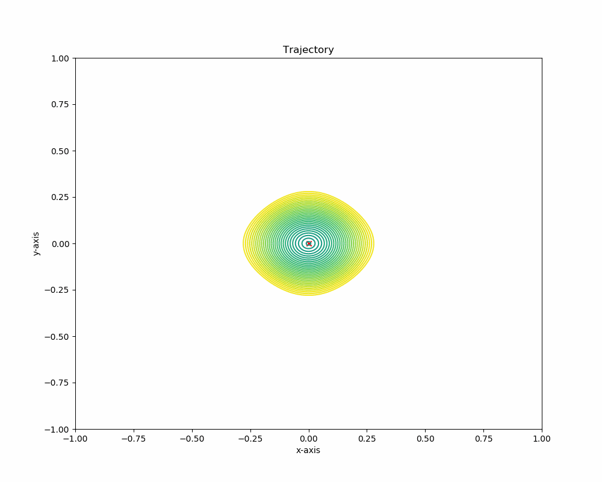
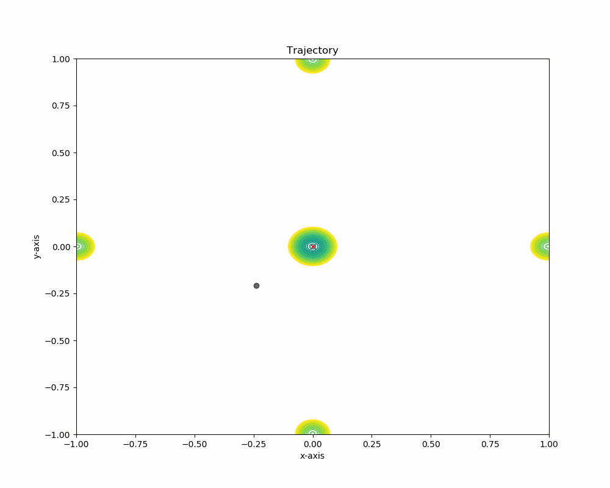
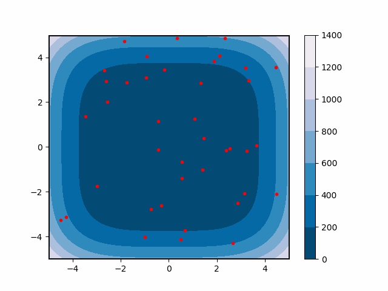
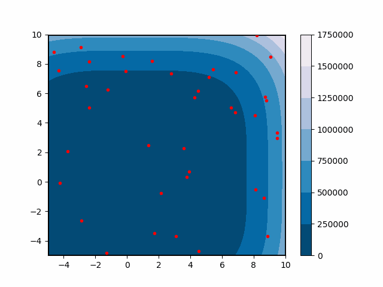
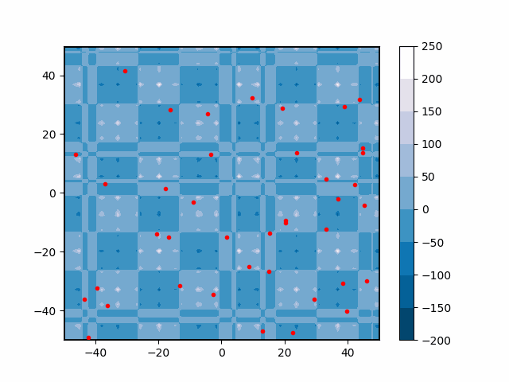
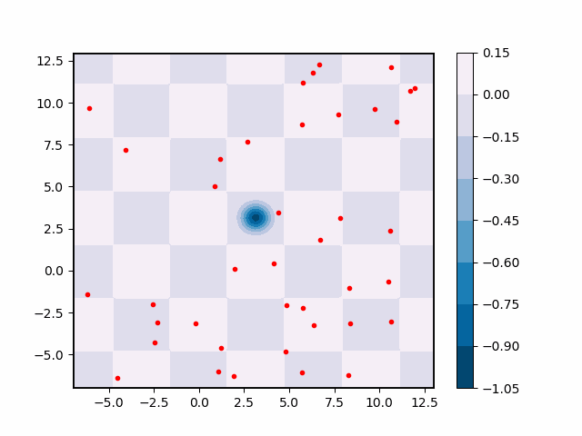

# FIREFLY-Algorithm VS Particle Swarm Optimization for various Multimodal Functions

>The implementation was part of the course [BITS F312-Neural Networks and Fuzzy Logic](https://sacbitspilani.files.wordpress.com/2018/07/bits-f312-neural-networkds-and-fuzzy-logic1.pdf) at Birla Institute of Technology & Science - Pilani in 2019.

## Multimodal Functions

* [ackley](https://www.sfu.ca/~ssurjano/ackley.html)
* [michalewicz](https://www.sfu.ca/~ssurjano/michal.html)
* [griewank](https://www.sfu.ca/~ssurjano/griewank.html)
* [rastrigin](https://www.sfu.ca/~ssurjano/rastr.html)
* [schwefel](https://www.sfu.ca/~ssurjano/schwef.html)
* [shubert](https://sfu.ca/~ssurjano/shubert.html)
* [deJong](https://www.sfu.ca/~ssurjano/dejong5.html)
* [easom](https://www.sfu.ca/~ssurjano/easom.html)
* [rosenbrock](https://www.sfu.ca/~ssurjano/rosen.html)
* [yang](https://sfu.ca/~ssurjano/shubert.html)

## Particle Swarm Optimization

This repository implements modified _particle swarm optimization_ that was introduced by Yuhui Shi and Russell C. Eberhart in their paper [A modified particle swarm optimizer](https://ieeexplore.ieee.org/document/699146) in 1998. Their approach introduces a so called _inertia weight_ w. [Original Particle Swarm Optimization.](https://ieeexplore.ieee.org/document/488968)

* **Ackley** 
 
* **Rastrigin** 
 
* **Yang** 
 
* **DeJong** 
 
* **Griewank** 
 
* **Shubert Function** 
 

## Firefly-Algorithm

This repository includes the _firefly algorithm_ like Xin-She Yang introduced in his paper [Firefly Algorithms for Multimodal Optimization](https://link.springer.com/chapter/10.1007%2F978-3-642-04944-6_14) in 2009.  

* **Ackley** 
 
* **deJong** 
 
* **michalewicz** 
 
* **rastrigin** 
 
* **griewank** 
 
* **rosenbrock** 
 
* **schwefel** 
 
* **shubert** 
 
* **easom** 
 

## References

[1](https://github.com/DavidAnson/markdownlint/blob/v0.20.2/doc/Rules.md#md033)
Yang, Xin-She. (2010). Firefly Algorithms for Multimodal Optimization. 5792. doi: 10.1007/978-3-642-04944-6_14.
[2](https://ieeexplore.ieee.org/document/699146)
Y. Shi and R. Eberhart, "A modified particle swarm optimizer," 1998 IEEE International Conference on Evolutionary Computation Proceedings. IEEE World Congress on Computational Intelligence (Cat. No.98TH8360), Anchorage, AK, USA, 1998, pp. 69-73, doi: 10.1109/ICEC.1998.699146.
[3](https://ieeexplore.ieee.org/document/488968)
J. Kennedy and R. Eberhart, "Particle swarm optimization," Proceedings of ICNN'95 - International Conference on Neural Networks, Perth, WA, Australia, 1995, pp. 1942-1948 vol.4, doi: 10.1109/ICNN.1995.488968.
